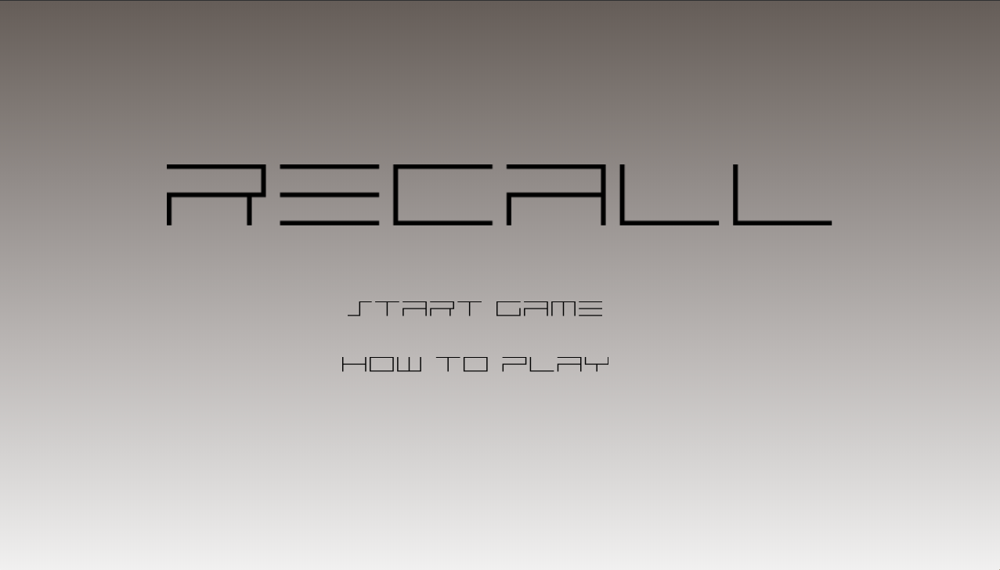
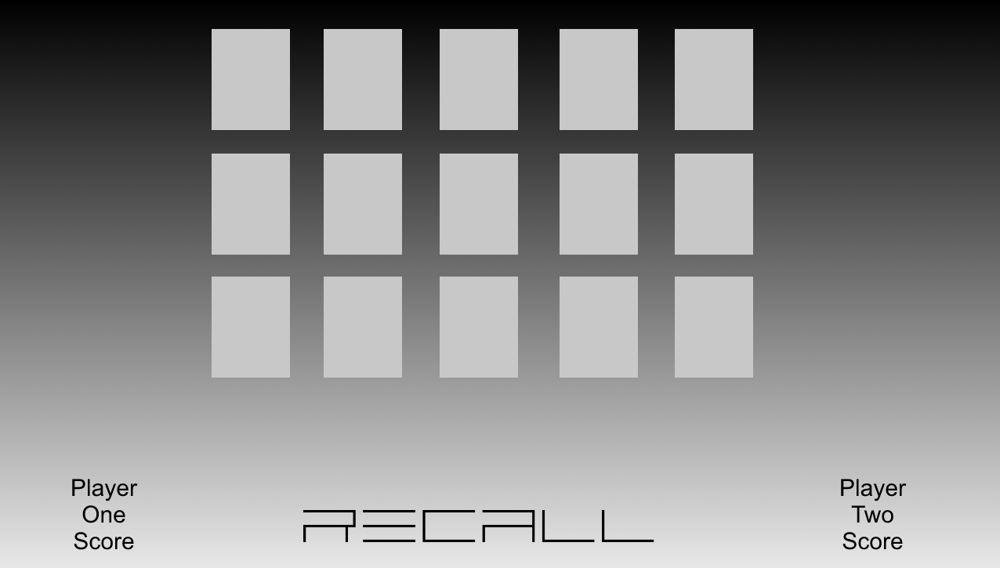

### RECALL
### Rules of the game
1. The game has two players.

2. Each player will take turns selecting two cards.

3. If the two cards match, the current player will receive points.

4. If they dont match, the cards stay on the board.

5. The game is over when all cards are matched.

6. The player with the most points wins.

### Technical Challenges

1. The randomization of the cards on the board. 

2. Ensuring only two of each kind is on the board at a time.

3. Possibly increasing diffculty after each round. (Larger board, more cards)

4. Additional Features

### Wireframe

### Additional Features 

1. Multiplayer. Human vs Human, Human vs CPU

### Tentative Timeline 

Tuesday : Write psuedocode and game logic, begin to build basic game functions.

Wednesday : Work on JS + HTML

Thursday : Work on JS + HTML

Friday : Work on JS + HTML

Saturday : CSS 

Sunday : CSS

Monday : Finish Additional Needs
